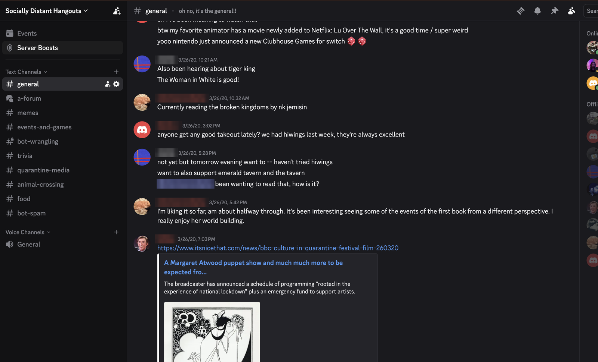
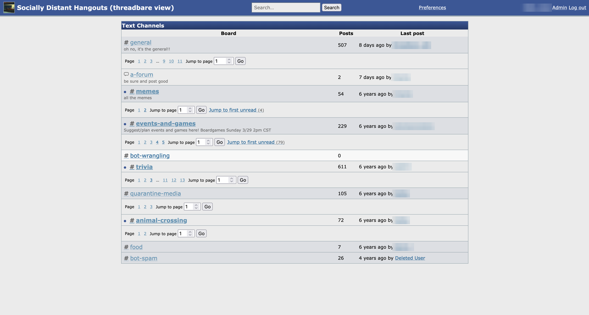
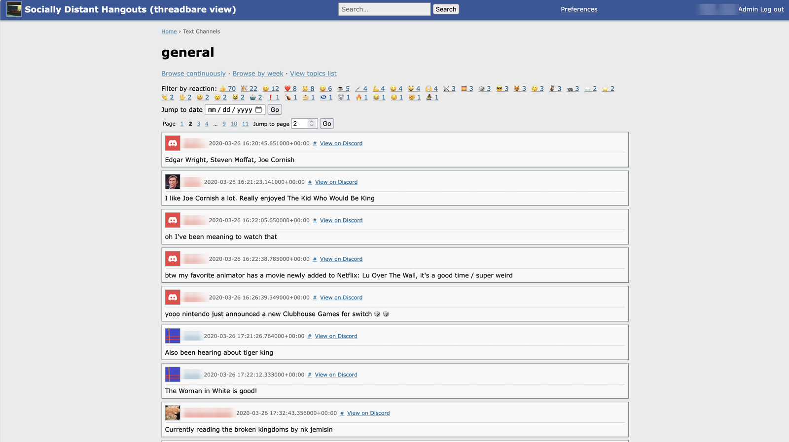

# Threadbare

A read-only, phpBB-style web interface for browsing the history of a Discord server.

Discord's client is built for the present moment: reading deep history means fighting infinite
scroll, lazy loading, and a search feature designed for finding one message rather than reading a
conversation. Threadbare presents the same content as a classic forum instead — boards, topics,
numbered pages, permalinks, and real search — while staying fully compliant with Discord's Terms
of Service and Developer Policy by operating exclusively through a bot account that the server's
moderators approve and install.

Threadbare is a **cache**, not an archive. Deletions on Discord propagate to Threadbare,
permissions are mirrored per user, and Discord remains the source of truth. See
[`DESIGN.md`](./DESIGN.md) for the full design.

## Screenshots

*Usernames are blurred in these screenshots; nothing else is edited.*

A busy `#general` on Discord — the source material:

[](./docs/images/discord-before.png)

The same server in Threadbare: channels become boards, with post counts and last-post times.

[](./docs/images/forum-board-index.png)

And the same `#general`, paginated, permalinked, filterable by reaction, jumpable by date:

[](./docs/images/forum-channel-view.png)

## Features

**Reading**

- Board index with post counts and last-post author/time; native Discord threads become topics.
- Paginated boards and topics (10/25/50/100 posts per page), numbered page links, jump-to-page,
  and jump-to-date.
- Freeform channels can be read either continuously or grouped into weekly pseudo-topics.
- Stable permalinks for every message, plus a "view on Discord" deep link per post.
- Per-user read markers and "jump to first unread".
- A reply-chain tree view as an alternative to flat chronological order.

**Search**

- Postgres full-text search (`tsvector`/GIN, Google-style query syntax) with author, channel, and
  date-range filters.
- Results link into their paginated context with the post anchored — not an isolated snippet.
- Filter any board, topic, or search by reaction ("show me everything this server 🔥'd").

**Faithful rendering**

- Discord-flavored markdown, custom emoji, spoilers, embeds, and attachments.
- Mentions resolved to display names; reply chains rendered as classic forum quote blocks.
- Reactions as aggregate counts (no per-user reactor identity is ever stored).
- Attachments served through a proxy endpoint that refreshes Discord's signed, expiring CDN URLs
  on demand, rather than mirroring files locally.

**Sync**

- Full backfill, resumable across restarts, plus a live gateway connection that applies new
  messages, edits, and deletions within seconds.
- A nightly reconciliation sweep repairs anything the gateway missed.

**Themes**

- Four shipped themes: subSilver-ish (the default), vBulletin dark, Terminal, and Plain — all
  user-selectable, with a mod-set default.
- Every theme honors `prefers-contrast` and `prefers-reduced-motion`.
- **Custom themes are a first-class feature, not an afterthought.** Threadbare renders one fixed
  set of semantic class names and every color, font, border, and radius is a CSS custom property,
  so a theme is a single stylesheet — no markup, no JavaScript, nothing to keep in sync with the
  app. Mods upload a theme as a `.zip` bundle (`theme.css` plus optional images, fonts, audio, and
  video) from the admin page, and it appears in every reader's theme switcher immediately.
  Bundles are validated against the same `:root` contract the built-ins demonstrate, so a broken
  theme is rejected with the problem named rather than shipped to readers.

  **[`docs/theming.md`](./docs/theming.md) is the guide for writing one**; the four built-ins are
  its worked examples, and [`theme-plain.css`](./src/threadbare/web/static/theme-plain.css) is the
  annotated reference implementation to copy from.

**Access and mod controls**

- Discord OAuth login gate — only members of the mirrored server can read anything.
- Per-user permission mirroring: role-gated channels are shown to exactly the people who can see
  them on Discord, and only after a mod opts that channel in.
- Admin page for mods: per-channel indexing and visibility toggles, custom theme registration,
  sync health, and the running version/migration state.
- A `/preferences` page for theme, avatar visibility, and posts-per-page.

**Setup**

- A first-run wizard with preflight checks: an unconfigured install serves the wizard instead of
  the forum, so installation is a guided flow rather than an environment-variable scavenger hunt.

## Compliance posture

Threadbare only ever talks to Discord as a bot, never as a user, and only accesses what the
installing server's mods explicitly enable ([`DESIGN.md` §3](./DESIGN.md#3-constraints-and-compliance-requirements)):

- **Bot-token access only** — no user tokens, ever.
- **Deletions are honored unconditionally** — removed from Threadbare in near-real-time via
  gateway events, and again via nightly reconciliation. There are no local backups of mirrored
  content, so deletion honoring is never "within backup retention".
- **Nothing is exposed that Discord wouldn't expose** — reading requires server membership and a
  login, and role-gated channels are filtered per user against mirrored Discord permissions.
- **Minimal data collection** — display names, avatars, roles, and message content needed for
  rendering. No emails, no presence, no per-user reaction identity.

## Installation

Threadbare is three always-on processes plus Postgres — the sync worker holds a persistent
Discord gateway connection, so this isn't a serverless-friendly app; it needs a machine that
stays on. `docker-compose.yml` runs the whole stack: web app, sync worker, Postgres
(internal-only, never exposed to the host), and [Caddy](https://caddyserver.com/) for automatic
HTTPS via Let's Encrypt.

**You'll need**: a machine that stays on (~1GB RAM idle, 2GB comfortable), Docker and the Compose
plugin, a domain name with an `A` record pointing at the machine, and ports 80/443 free.

```bash
git clone <this repo> && cd threadbare
./scripts/install.sh     # prompts for your site's URL, writes .env, starts the stack
```

Then open your site and follow the setup wizard — it walks you through creating the Discord bot,
runs preflight checks, and lets you choose which channels to index. When it finishes, run
`docker compose restart sync-worker` once.

Pick a hosting path:

- **[Option A — your own hardware](./docs/self-hosting.md#option-a--self-host-on-your-own-hardware)**:
  the cheapest option. Any always-on machine, down to a Raspberry Pi–class box. The extra work is
  reachability, not resources.
- **[Option B — a small VPS](./docs/self-hosting.md#option-b--vps-recommended)** (recommended): a
  $5–10/month instance is comfortable at 2GB RAM, and you get a real public IP for free.
- **[Option C — AWS via CDK](./deploy/cdk/README.md)**: a TypeScript CDK app (Fargate + ALB +
  Postgres on an EBS-backed volume). `cdk synth` is verified; a real `cdk deploy` is **not** — no
  AWS account was available to exercise it. The setup wizard doesn't apply on this path; see that
  README for why.

**[`docs/self-hosting.md`](./docs/self-hosting.md)** is the step-by-step version of all of the
above, written for admins who haven't run a server before — DNS, firewall, SSH, running at a
subpath, forcing a re-backfill, and troubleshooting.

### Upgrading

`./scripts/upgrade.sh` (Options A/B) or `./deploy/cdk/upgrade.sh` (Option C) fetches,
fast-forwards, rebuilds, and restarts; migrations apply automatically. Afterward, check the admin
page's **Version** section (`/admin/`) to confirm the running version and latest applied migration
are what you expect. The contract every release honors — additive-only migrations, config
backward-compatibility, and refusing to boot on a stale schema rather than misbehaving — is in
[`DESIGN.md` §7](./DESIGN.md#upgrade-contract).

> **One-time manual step when upgrading past the 2026-07-25 audit pass.**
> `DISCORD_TEST_GUILD_ID` was renamed to `DISCORD_GUILD_ID`, deliberately with no fallback, so
> this one upgrade needs a hand edit before the stack will boot. If you forget, the app exits with
> a message naming the rename rather than an opaque "required" error.
> [Instructions for both paths](./docs/self-hosting.md#upgrading-past-the-2026-07-25-audit-pass-rename-one-env-line).

### Working on Threadbare itself

See [`DEVELOPMENT.md`](./DEVELOPMENT.md) for environment setup (uv, Postgres via Docker,
Playwright), the test tiers and how to run them, and how to configure a test Discord bot.

## Documentation

- [`DESIGN.md`](./DESIGN.md) — architecture, data model, compliance rationale, and the migration
  path beyond v1.
- [`ROADMAP.md`](./ROADMAP.md) — what's built and in what order. v1, role-gated channels with
  permission mirroring (Phase 2), and the reading-experience depth features (Phase 3) are all
  shipped; a nightly backup job for Threadbare's own config tables is the main open item.
- [`DEVELOPMENT.md`](./DEVELOPMENT.md) — dev environment, test suite, test Discord bot.
- [`docs/self-hosting.md`](./docs/self-hosting.md) — deployment, operations, and troubleshooting.
- [`docs/theming.md`](./docs/theming.md) — writing a custom theme: the `:root` contract, the
  bundle format, and the mistakes that have actually bitten the built-in themes.
- [`RESOLVED_ISSUES.md`](./RESOLVED_ISSUES.md) — a log of real bugs found and fixed, kept because
  several of them are load-bearing lessons about this stack.
- [`CLAUDE.md`](./CLAUDE.md) — repo conventions (stack choices, the theme readability bar, TDD).

## License

TBD.
